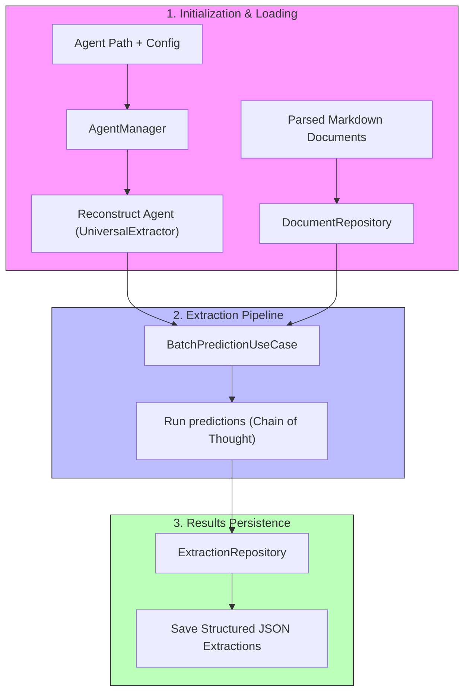

# Extraction Module Architecture & Workings

## 1. Overview & Core Features

The **Extraction** module processes parsed chemistry papers in batch to extract structured data (such as scientific experiments) using pre-trained agents and LLMs.

### Key Capabilities:
*   **Structured Data Extraction**: Batch processing of unstructured texts into clean, schema-conforming JSON fields using language models.
*   **Chain-of-Thought (CoT) Reasoning**: Enforcing step-by-step reasoning steps before returning target schema layouts for increased extraction precision.
*   **Agent Lifecycle Management**: Capabilities for serializing, loading, and reconstructing pre-trained prompt weights.

---

## 2. Command Line Interface & Usage

*   **CLI Command**: `ae-extract` (defined in [cli.py](../src/ae/extraction/cli.py)).
*   **CLI Usage**:
    ```bash
    ae-extract --agent AGENT_PATH [--config CONFIG_DIR]
    ```
*   **Arguments & Flags**:

| Flag / Option | Argument Type | Description |
| :--- | :--- | :--- |
| `--agent` | Path | **Required**. Path to the trained agent JSON file containing optimized prompts/weights. |
| `--config` | Path | Path to configuration directory (defaults to root `config/` directory). |

---

## 3. Architecture & Key Code Components

The Extraction module implements batch processing of documents by loading serialized agent prompts and mapping extraction predictions to target schemas.

*   **Key Code Components**:

| File Link | Class / Function | Role / Description |
| :--- | :--- | :--- |
| [pipeline.py](../src/ae/extraction/pipeline.py) | [BatchPredictionUseCase](../src/ae/extraction/pipeline.py#L60) | Orchestrates the document loading, agent execution, and results saving. |
| [agent.py](../src/ae/extraction/agent.py) | [UniversalExtractor](../src/ae/extraction/agent.py#L51) | Task-agnostic extraction agent implementing Chain-of-Thought reasoning. |
| [manager.py](../src/ae/extraction/manager.py) | [AgentManager](../src/ae/extraction/manager.py#L20) | Deserializes the saved agent JSON, validating state layouts to reconstruct runtime modules. |
| [extractions.py](../src/ae/core/storage/extractions.py) | [ExtractionRepository](../src/ae/core/storage/extractions.py#L19) | Validates extractions against target Pydantic schemas and saves structured results. |

---

## 4. Configuration & Parameter Mapping

Configuration settings are loaded from `config/core.yaml` and `config/extraction.yaml`:

| YAML Path | Variable Mapping | Type | Description |
| :--- | :--- | :--- | :--- |
| `extraction.enable_cache` | `custom_settings.extraction.enable_cache` | bool | Enables/disables LLM caching during batch runs (Default: `false`). |
| `extraction.save_llm_history` | `custom_settings.extraction.save_llm_history` | bool | If enabled, records complete prompts and outputs to logs (Default: `false`). |
| `extraction.llm_history_dir` | `custom_settings.extraction.llm_history_dir` | str | Target directory where LLM log files are saved (Default: `logs/llm_history`). |

---

## 5. Module Workings & Data Flow



### Detailed Phases & In-Process Pipeline:
1.  **Initialization Phase**:
    *   [AgentManager](../src/ae/extraction/manager.py#L20) loads agent configs and prompt weights from the target JSON file.
    *   Instantiates the [UniversalExtractor](../src/ae/extraction/agent.py#L51) with the target schema class (signature) and restores prompt templates and few-shot states calling `.load_state()`.
2.  **Extraction Phase**:
    *   Orchestrator loads input Markdown documents from `DocumentRepository`.
    *   Each document is run through the reconstructed agent sequentially: the model writes out its step-by-step reasoning narrative, then structures chemical experiments matching the signature.
3.  **Persistence Phase**:
    *   The `ExtractionRepository` writes extracted fields to target JSON paths.

---

## 6. Input/Output Data Formats

### Workspace Directory Layout:
```text
├── data/
│   ├── parsed/
│   │   └── <doc_id>.md      # Input parsed Markdown files
│   ├── agents/
│   │   └── <agent_name>.json # Saved prompt instructions and demonstrations
│   └── extractions/
│       └── <doc_id>.json    # Final structured output files
└── logs/
    └── llm_history/         # History directories containing LLM logs
```

### Format Details:
*   **Input Markdown**: Structured Markdown text representing the target parsed chemistry articles.
*   **Output JSON Extraction**: Structured output containing target arrays and source metadata:
    ```json
    {
      "extraction": {
        "experiments": [
          {
            "formula": "Fe3O4",
            "activity": "peroxidase",
            "size": "12 nm",
            "pH": 4.0
          }
        ]
      },
      "source_metadata": {
        "document_id": "nano_paper_1"
      }
    }
    ```

---

## 7. Error Handling & Resiliency

*   **Circuit Breaker Protection**: To avoid runaway API costs, a circuit breaker tracks consecutive Student LLM failures. If failures exceed the threshold (default: `8` failures, defined in `config/core.yaml`), the circuit breaker trips **OPEN**, raising `CircuitBreakerError` and immediately aborting batch processing.
*   **Fail-Soft Batch Run**: If a single document fails extraction due to content parsing errors, the error is logged as a warning, and the orchestrator skips to the next document in the batch instead of crash-terminating the command.

> [!TIP]
> Use the optional LLM history tracking under `logs/llm_history` to inspect the exact prompt templates and few-shot examples transmitted to the Student LLM during CoT execution.
