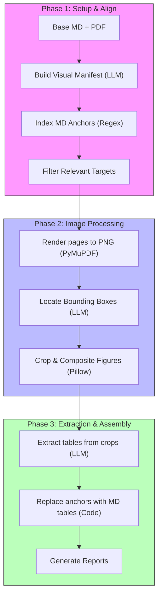

# Ingestion Module Architecture & Workings

## 1. Overview & Core Features

The **Ingestion** module converts raw chemistry PDF papers into structured Markdown. This is the first step in the Adaptive Extractor pipeline, preceding prompt optimization and final data extraction.

### Key Capabilities:
*   **Standard Text Extraction**: Sequence-aware parsing of PDF texts while preserving reading order.
*   **Table Layout Preserving**: Automatic conversion of standard PDF tables into HTML `<table>` elements to maintain row and column spans.
*   **Visual-Informed Parsing**: Rendering page regions, bounding box detection of figures and charts, and extraction of visual data as Markdown tables.

---

## 2. Command Line Interface & Usage

*   **CLI Command**: `ae-parse` (defined in [cli.py](../src/ae/ingestion/cli.py)).
*   **CLI Usage**:
    ```bash
    ae-parse [--config CONFIG_DIR] [--overwrite]
    ```
*   **Arguments & Flags**:

| Flag / Option | Argument Type | Description |
| :--- | :--- | :--- |
| `--config` | Path | Path to configuration directory (defaults to root `config/` directory). |
| `--overwrite` | flag | If present, overwrites existing parsed Markdown files in the output directory. |

---

## 3. Architecture & Key Code Components

The Ingestion module implements the Strategy Pattern to dynamically switch between standard and visually enriched parsing engines.

*   **Key Code Components**:

| File Link | Class / Function | Role / Description |
| :--- | :--- | :--- |
| [pipeline.py](../src/ae/ingestion/pipeline.py) | [ParseDocumentsUseCase](../src/ae/ingestion/pipeline.py#L59) | Orchestrates the end-to-end PDF-to-Markdown batch parsing pipeline. |
| [base_parser.py](../src/ae/ingestion/base_parser.py) | [BaseParser](../src/ae/ingestion/base_parser.py#L9) | Abstract strategy interface defining the `.parse()` contract. |
| [parsers.py](../src/ae/ingestion/parsers.py) | [get_parser](../src/ae/ingestion/parsers.py#L14) | Factory function that instantiates the parser based on selected configurations. |
| [gemini_parser.py](../src/ae/ingestion/gemini_parser.py) | [GeminiParser](../src/ae/ingestion/gemini_parser.py#L168) | Standard text parser using the Google Gemini API. |
| [visual_parser.py](../src/ae/ingestion/visual_parser.py) | [AEVisualParser](../src/ae/ingestion/visual_parser.py#L17) | Enriched parser integrating layout analysis and visual extraction. |

---

## 4. Configuration & Parameter Mapping

Configuration parameters are loaded from `config/core.yaml` and `config/ingestion.yaml`:

| YAML Path | Variable Mapping | Type | Description |
| :--- | :--- | :--- | :--- |
| `paths.pdf_dir` | `custom_settings.paths.pdf_dir` | Path | Directory containing raw input PDFs (Default: `data/pdf`). |
| `paths.parsed_dir` | `custom_settings.paths.parsed_dir` | Path | Directory where parsed Markdown results are stored (Default: `data/parsed`). |
| `parsing.visual.enabled` | `custom_settings.parsing.visual.enabled` | bool | Enables (`true`) visual-informed mode or standard text mode (`false`). |
| `parsing.gemini.model` | `custom_settings.parsing.gemini.model` | str | Gemini model instance used for base Markdown conversion (Default: `gemini-3-flash-preview`). |
| `parsing.gemini.upload_timeout` | `custom_settings.parsing.gemini.upload_timeout` | int | Timeout in seconds for PDF uploads to the Gemini API (Default: `300`). |

---

## 5. Module Workings & Data Flow



### Detailed Phases & In-Process Pipeline:
1.  **Standard Mode (`gemini`)**: The `GeminiParser` uploads the PDF directly, sequentially parses the text, formats tables as HTML, and inserts anchors before figures: `<!-- AE_VISUAL_ANCHOR: <normalized_id> -->`.
2.  **Enriched Mode (`gemini_visual`)**: The `AEVisualParser` calls `GeminiParser` to extract base text and anchors, then triggers [run_visual_pipeline](../src/ae/ingestion/visual_pipeline/__init__.py#L25) which executes these stages:
    *   **Stage 1: Manifest**: Generates a figure manifest via Gemini ([manifest.py](../src/ae/ingestion/visual_pipeline/stages/manifest.py)).
    *   **Stage 2: Anchor Indexing**: Scans base Markdown for anchor comments via regex ([md_anchors.py](../src/ae/ingestion/visual_pipeline/stages/md_anchors.py)).
    *   **Stage 3: Target Matching**: Aligns figure anchors with manifest descriptions ([create_targets.py](../src/ae/ingestion/visual_pipeline/stages/create_targets.py)).
    *   **Stage 4: Page Rendering**: Renders target pages to high-resolution PNGs ([render_pages.py](../src/ae/ingestion/visual_pipeline/stages/render_pages.py)).
    *   **Stage 5: Bbox Localization**: Detects exact bounding box coordinates of charts ([locate_bboxes.py](../src/ae/ingestion/visual_pipeline/stages/locate_bboxes.py)).
    *   **Stage 6: Figure Cropping**: Crops target areas using Pillow ([crop_figures.py](../src/ae/ingestion/visual_pipeline/stages/crop_figures.py)).
    *   **Stage 7: Data Extraction**: Formats crop visual data into structured Markdown/HTML tables ([extract_chart_tables.py](../src/ae/ingestion/visual_pipeline/stages/extract_chart_tables.py)).
    *   **Stage 8: Table Insertion**: Injects tables into the Markdown document, substituting target anchors ([insert_visual_tables.py](../src/ae/ingestion/visual_pipeline/stages/insert_visual_tables.py)).
    *   **Stage 9: Report Compilation**: Saves final insertion logs and statistics ([build_report.py](../src/ae/ingestion/visual_pipeline/stages/build_report.py)).

---

## 6. Input/Output Data Formats

### Workspace Directory Layout:
```text
├── data/
│   └── pdf/
│       └── article.pdf                  # Raw input PDF document
├── data/parsed/
│   ├── article.md                       # Parsed Markdown text with anchors
│   ├── assets/
│   │   ├── pages/page_0003.png              # Rendered page image
│   │   ├── overlays/target_0001.page_0003.png # Image overlay showing detected Bbox coordinates
│   │   └── crops/target_0001.png            # Cropped chart/figure image
│   └── service/
│       ├── table_insertion/
│       │   ├── article.with_visual_tables.md # Final output (Markdown + charts as tables)
│       │   └── table_insertion_report.md    # Detail report of skipped/inserted tables
│       └── report/
│           └── visual_report.md             # Ingestion pipeline summary metrics
```

### Format Details:
*   **Input PDF**: Standard chemistry research paper containing text, plots, and tables.
*   **Output Markdown**: Well-formatted Markdown document. Visual-mode output (`article.with_visual_tables.md`) substitutes figure visual anchors with detailed Markdown/HTML tables.

---

## 7. Error Handling & Resiliency

*   **API Connection Failures**: The parser intercepts transient connection, timeout, and HTTP 503/504 errors, executing retries (default: `max_retries=3`) with progressive backoff.
*   **Directory Initialization**: Output directories are automatically created if they do not exist.
*   **Graceful Termination**: Parsing statistics are summarized upon completion, highlighting any document parsing failures without aborting the entire command run.

> [!TIP]
> The primary output file for downstream extraction is `article.with_visual_tables.md` (when visual parsing is enabled) or `article.md` (standard parsing). Use the overlays in `assets/overlays/` to verify bounding box coordinate extraction accuracy.
