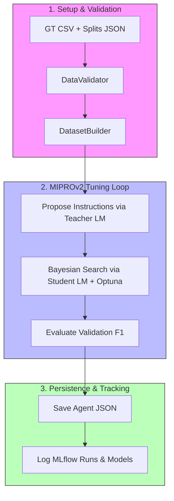

# Optimization Module Architecture & Workings

## 1. Overview & Core Features

The **Optimization** module automates extraction agent prompt and instruction tuning using DSPy's MIPROv2 Bayesian optimization. It also handles ground truth validation, dataset compilation, and MLflow experiment tracking.

### Key Capabilities:
*   **Prompt Self-Optimization**: Proposing, testing, and selecting high-performing prompt instructions and few-shot examples.
*   **Validation Checks**: Pre-flight data validation ensuring splits consistency and ground-truth alignments.
*   **Experiment Tracking**: Automatic logging of runs, metrics, and models to MLflow.

---

## 2. Command Line Interface & Usage

*   **CLI Command**: `ae-optimize` (defined in [cli.py](../src/ae/optimization/cli.py)).
*   **CLI Usage**:
    ```bash
    ae-optimize [--config CONFIG_DIR] [--run-name RUN_NAME] [--no-mlflow]
    ```
*   **Arguments & Flags**:

| Flag / Option | Argument Type | Description |
| :--- | :--- | :--- |
| `--config` | Path | Path to configuration directory (defaults to root `config/` directory). |
| `--run-name` | str | Short name prefix for the MLflow run (timestamps are appended automatically). |
| `--no-mlflow` | flag | Disables MLflow tracking for the optimization run. |

---

## 3. Architecture & Key Code Components

The Optimization module is designed to load, validate, build, and optimize datasets while logging metrics to MLflow.

*   **Key Code Components**:

| File Link | Class / Function | Role / Description |
| :--- | :--- | :--- |
| [orchestrator.py](../src/ae/optimization/orchestrator.py) | [OptimizeAgentUseCase](../src/ae/optimization/orchestrator.py#L120) | Orchestrates the end-to-end self-tuning pipeline. |
| [dataset.py](../src/ae/optimization/dataset.py) | [DatasetBuilder](../src/ae/optimization/dataset.py#L326) | Compiles training/evaluation `dspy.Example` datasets from Markdown files and CSV ground truths. |
| [dataset.py](../src/ae/optimization/dataset.py) | [DataValidator](../src/ae/optimization/dataset.py#L51) | Performs pre-flight validations on train/val splits and document presence. |
| [tracking.py](../src/ae/optimization/tracking.py) | [ExperimentTracker](../src/ae/optimization/tracking.py#L15) | Manages parameter, metric, and artifact logging in MLflow. |

---

## 4. Configuration & Parameter Mapping

Configuration settings are loaded from `config/core.yaml` and `config/optimization.yaml`:

| YAML Path | Variable Mapping | Type | Description |
| :--- | :--- | :--- | :--- |
| `optimization.total_load` | `val_limit` | int | Total number of dataset examples to load (Default: `10`). |
| `optimization.train_split` | `train_limit` | int | Number of examples allocated to the training split (Default: `9`). |
| `optimization.num_candidates` | `num_candidates` | int | Candidate instructions to generate per predictor (Default: `8`). |
| `optimization.num_trials` | `num_trials` | int | Total number of Bayesian search trial steps to run (Default: `25`). |
| `optimization.max_bootstrapped_demos` | `max_bootstrapped_demos` | int | Max bootstrapped few-shot examples (Default: `0` for zero-shot). |
| `optimization.max_labeled_demos` | `max_labeled_demos` | int | Max hand-labeled examples in context (Default: `1`). |
| `optimization.metric_threshold` | `metric_threshold` | float | Target validation score (0.0 to 1.0) to trigger early stopping. |
| `optimization.max_errors` | `max_errors` | int | Maximum allowed trial failures before aborting the run (Default: `3`). |

---

## 5. Module Workings & Data Flow



### Detailed Phases & In-Process Pipeline:
1.  **Validation & Setup Phase**:
    *   [DataValidator](../src/ae/optimization/dataset.py#L51) reads data splits and ground truth. It validates that splits files contain valid names (`train`, `val`), checks for duplicates and splits overlap, verifies that all split keys are registered in the ground truth CSV, and normalizes document names.
    *   [DatasetBuilder](../src/ae/optimization/dataset.py#L326) processes valid document Markdown keys, loads corresponding parsed texts, and loads ground truth records to output compiled sets of `dspy.Example`.
2.  **Tuning Loop (MIPROv2)**:
    *   Teacher LM summarizes the dataset and extraction module structures.
    *   Generates `num_candidates` proposed instructions and sets up Optuna Bayesian search.
    *   For each trial, Optuna proposes a configuration of instructions and few-shot examples.
    *   Evaluates prompt layouts on the validation split using the Student LLM. Evaluators calculate extraction metrics (precision, recall, F1-score) by validating predicted objects against ground truth lists.
3.  **Persistence & Logging Phase**:
    *   The best optimized instruction set and demonstration weights are saved to a task-specific agent JSON file.
    *   Metrics, run configs, and models are registered in MLflow.

---

## 6. Input/Output Data Formats

### Workspace Directory Layout:
```text
├── config/
│   └── settings.yaml        # Optimization settings and LM parameters
├── data/
│   ├── ground_truth/
│   │   └── <task_name>.csv  # CSV ground truth containing target extraction outputs
│   ├── splits/
│   │   └── <task_name>.json # JSON data splits (lists of train/val documents)
│   └── agents/
│       └── <agent_name>.json # Serialized optimized agent output
└── logs/
    └── llm_history/         # History files containing raw LLM requests and responses
```

### Format Details:
*   **Ground Truth CSV**: Must contain a document identifier column (`pdf`, `filename`, `source`, `doi`, or `document`) and corresponding target extraction rows.
*   **Data Splits JSON**: Standard JSON dictionary defining splits arrays:
    ```json
    {
      "train": ["doc_key_1", "doc_key_2"],
      "val": ["doc_key_3"]
    }
    ```
*   **Saved Agent JSON**: State file containing serialized signature instructions, input/output structures, and optimized CoT weight variables.

---

## 7. Error Handling & Resiliency

*   **Pre-flight Failure Interception**: The `DataValidator` raises immediate exceptions on duplicate split entries, empty sets, or missing ground-truth coverage, preventing wasted API costs.
*   **Fault Safeguard**: The tuning loop tracks failed LLM calls per trial. If total call failures exceed `max_errors`, the optimizer aborts execution.
*   **Caching Support**: Response caching is enabled by default to speed up iterative Bayesian trials.

> [!TIP]
> Keep at least 3–5 documents in the validation (`val`) split for reliable F1-score evaluation.
